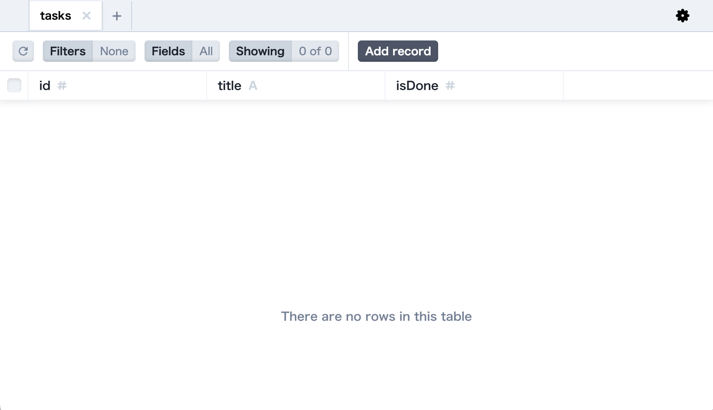
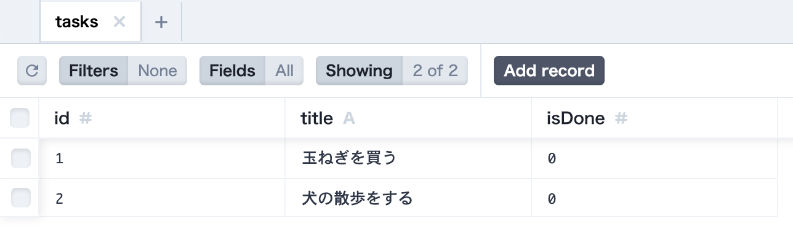
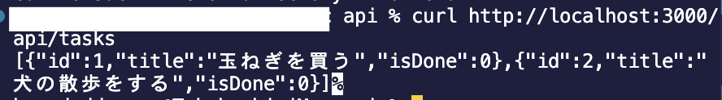

Training Vue3 | [目次](TOC.md)
# DBのデータを操作する（API）

- [DBのデータを操作する（API）](#dbのデータを操作するapi)
  - [Express + Prisma](#express--prisma)
    - [Prismaを入れる](#prismaを入れる)
    - [Expressを入れる](#expressを入れる)
  - [APIを書く](#apiを書く)
    - [nodemonを入れる](#nodemonを入れる)
    - [APIを書く](#apiを書く-1)
  - [curlでAPIを叩いてみる](#curlでapiを叩いてみる)

## Express + Prisma
実はVue.jsから直にSQLiteのdbに対して読み書きすることはできません。
SQLiteを操るwebサーバーが必要になります。
ですがWebサーバーを建てるのはちょっと難しいですよね。
ので、間にwebサーバーを立ててくれるExpressというプラグインを使用します。
また、js/tsでDBを直感的に操作しやすくするPrismaというツールも入れてみます。


### Prismaを入れる
まずはプロジェクトのルートにapi用のフォルダを作り、Node.jsの初期化をします。

```shell
% mkdir api
% cd api
% npm init -y
```

Prismaをdev-dependency（`-D`オプション）としてインストールします。

```shell
% npm install -D prisma
```

次にPrismaの初期化を行います。
オプションでDBの種類を指定することができますので、sqliteを指定します。

```shell
% npx prisma init --datasource-provider sqlite
```

実行するとapi/prisma/schema.prismaファイルが作成されます。
中身を見てみましょう。

`api/prisma/schema.prisma`
```js
// This is your Prisma schema file,
// learn more about it in the docs: https://pris.ly/d/prisma-schema

generator client {
  provider = "prisma-client-js"
}

datasource db {
  provider = "sqlite"
  url      = env("DATABASE_URL")
}
```

SQLite用の記述になっていますね。

ここにモデルを追加します。
モデルは、テーブルとその内容について形式を決めるものです。
```js
model tasks {
  id Int @id @default(autoincrement())
  title String
  isDone Int
}
```
ターミナルでマイグレーションを実行します。

```shell
% npx prisma migrate dev --name init
```
実行するとapiの中にdbが作成され、taskテーブルも追加されています。
マイグレーションを実行することでjsのコードからPrismaがDBの構造やデータを更新します。
SQL文がわからなくても、Prismaが裏側で自動でを生成して実行してくれています。
モデルに変更があった際もマイグレーションを行えばPrismaが構造を更新してくれます。

PrismaにはDBをGUIで見られるPrisma studioというツールが付属しています。

```shell
% npx prisma studio
```


[Add record]から、テスト用にデータを追加しておきましょう。




### Expressを入れる

```shell
% npm install express
% npm install -D @types/express
```

## APIを書く
expressが入りましたので、早速APIを作っていきましょう。

### nodemonを入れる
API開発を快適にするために、
コードが更新された時に自動でサーバーを再起動してくれる
`nodemon`というツールをdevDependenciesとしてインストールしておきます。
```shell
npm install -D nodemon
```
そして、package.jsonのscriptにサーバー起動の`start`を追加しておきます。
```
"start": "nodemon --exec node src/index.js",
```

### APIを書く
それではAPIを書いていきましょう。

```shell
% mkdir src
% cd src
% touch index.js
```

srcディレクトリを作って、その中にindex.jsを作成しました。
このindex.jsの中に書いていきます。

ひとまずタスクを全てgetするapiを書いてみます。

`api/src/index.js`
```js

import express from "express";
import { PrismaClient } from "@prisma/client";

const prisma = new PrismaClient();
const app = express();
app.use(express.json());
app.use(express.urlencoded({extended: true }));

app.get('/api/tasks', async (req, res) => {
    const tasks = await prisma.tasks.findMany();
    res.json(tasks);
})

const PORT = process.env.PORT || 3000;

app.listen(PORT, () => {
    console.log(`Server is running on port ${PORT}`);
});
```

## curlでAPIを叩いてみる
Expressサーバを起動して
実際にAPIを叩いてみましょう。

```shell
% npm start

> api@1.0.0 start
> nodemon --exec node src/index.js

[nodemon] 3.1.7
[nodemon] to restart at any time, enter `rs`
[nodemon] watching path(s): *.*
[nodemon] watching extensions: js,mjs,cjs,json
[nodemon] starting `node src/index.js`
Server is running on port 3000
```
起動できました！

では別窓でターミナルを開いて実際にこのExpressのapiサーバにアクセスしてみます。

```shell
% curl http://localhost:3000/api/tasks
```


ちゃんとDB上にあるデータが返ってきましたね。

CRUDでもまだCRUDのうちのRだけなので、
CUDのAPIも作っておきます。

```js
// GET ALL
app.get("/api/tasks", async (req, res) => {
  const tasks = await prisma.tasks.findMany();
  res.json(tasks);
});

// CREATE
app.post("/api/create", async (req, res) => {
  try {
    const { title, isDone } = req.body;
    if (!title || !isDone) {
      return res
        .status(400)
        .json({ message: "title and isDone are required." });
    }

    const task = await prisma.post.create({
      data: { title, isDone },
    });

    return res
      .status(201)
      .json({ message: "Task created successfully", data: task });
  } catch (error) {}
});

// UPDATE
app.put("/api/tasks/:id", async (req, res) => {
  const { id } = req.params;
  const { title, isDone } = req.body;
  try {
    const updatedTask = await prisma.post.update({
      where: { id: parseInt(id) },
      data: { title, isDone },
    });
    return res.json({
      message: "Task updated successfully",
      data: updatedTask,
    });
  } catch (error) {
    console.log(error);
    return res.status(500).json({ message: "Error updating task" });
  }
});

// DELETE
app.delete("/api/tasks/:id", async (req, res) => {
  const { id } = req.params;
  try {
    await prisma.post.delete({
      where: { id: parseInt(id) },
    });
    return res.json({ message: "Task deleted successfully" });
  } catch (error) {
    return res.status(500).json({ message: "Error deleting task" });
  }
});
```

これでAPIは完成です。


***
[データを永続化しよう](sqlite.md) | [フロントエンドからAPIリクエストする](api_request.md)