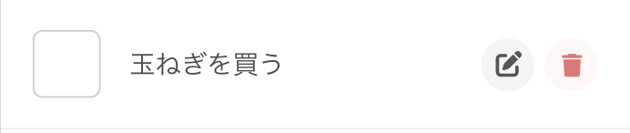

Training Vue3 + Express + Prisma | [目次](README.md)
# 共通のパーツをcomponentsに切り分ける

- [共通のパーツをcomponentsに切り分ける](#共通のパーツをcomponentsに切り分ける)
  - [どこをcomponentsにするか？](#どこをcomponentsにするか)
    - [責務とは？](#責務とは)
  - [まずはheaderとfooterを分けてみよう](#まずはheaderとfooterを分けてみよう)
  - [コンポーネントの呼び出し](#コンポーネントの呼び出し)
  - [footerに各画面へのナビを作る](#footerに各画面へのナビを作る)
    - [SVGアイコンをコンポーネントにして呼び出す](#svgアイコンをコンポーネントにして呼び出す)
  - [情報をコンポーネントに渡す（props）](#情報をコンポーネントに渡すprops)
    - [親から子に情報を渡すprops](#親から子に情報を渡すprops)
    - [親側（GlobalFooter.vue）](#親側globalfootervue)
    - [子側（IconUser.vue他）](#子側iconuservue他)
    - [最終的な形](#最終的な形)
  - [ToDo画面の内容を作る](#todo画面の内容を作る)
    - [リストレンダリング `v-for`](#リストレンダリング-v-for)
      - [リストアイテムの構造を作る](#リストアイテムの構造を作る)
    - [`v-for`で配列の内容を反映する](#v-forで配列の内容を反映する)
    - [イベントハンドリング `v-on`](#イベントハンドリング-v-on)
  - [GlobalHeaderやToDo以外のViewを自分で実装しよう](#globalheaderやtodo以外のviewを自分で実装しよう)
  - [参考資料](#参考資料)

## どこをcomponentsにするか？
どのくらい細かく分けるかについてはプロジェクトの規模感や設計、思想など
様々な要因があり、ベストプラクティスはないかもしれません。

ですが、プログラムが書かれているファイルとして共通で言えるのは、
中身が1000行とか2000行とかあるとソースを見るのが大変だということです。

なので個人的には再利用可能にしたいかという基準以外にも、
その1ファイル内で管理するには大きすぎる（あるいは責務が多すぎる）、と思ったら
コンポーネントに切り分けしまった方が良いという感覚です。

### 責務とは？
そのコードが果たすべき目的の範囲です。
1コンポーネントにさまざまな役割を持たせて複数の仕事をつめこむのではなく、
なるべく1つの目的・役割だけに絞られている方がそのコンポーネントでしていることが
わかりやすくなります。
1つファイルに単一の責務を持たせるということを意識して分けていくと良いでしょう。


## まずはheaderとfooterを分けてみよう
責務について書きましたが、
今回は小さくシンプルなアプリケーションを作るので、
そこまで気にすることがありません。
一旦、複数のviewで表示されるheader、footerをコンポーネントを分けてみます。

2つのファイルを作りましょう。

`src/components/GlobalHeader.vue`
```
<script setup>
</script>

<template>
  <header>
    <h1>My ToDo App</h1>
  </header>
</template>

<style scoped>
</style>
```

`src/components/GlobalFooter.vue`
```
<script setup>
</script>

<template>
  <footer>global footer</footer>
</template>

<style scoped>
</style>
```

## コンポーネントの呼び出し
この時点ではまだどこにも呼び出していないので画面の表示は変わりません。
今回は、現状headerとfooterがベタ書きされている、App.vueにこの2つのコンポーネントを呼び出してみましょう。

`src/App.vue`
```vuejs
<script setup>
import { RouterView } from 'vue-router'
import GlobalHeader from './components/GlobalHeader.vue';
import GlobalFooter from './components/GlobalFooter.vue';
</script>

<template>
  <GlobalHeader />
  <RouterView />
  <GlobalFooter />
</template>

<style scoped>
</style>
```
`<script setup>`内に`import 任意の名前 from "コンポーネントのパス"` の形で使いたいコンポーネントをインポートします。
インポートすると`<template>`の中でhtmlタグのような形で`<つけた名前>`で呼び出すことができます。

<details>
<summary>TIPS: importするときの名前</summary>

今回は`<GlobalHeader />` `<GlobalFooter />`というようにファイル名に一致させていますが、この名前はファイル名に一致しなくてもよく、好きな名前をつけられます。
[jsのモジュールインポート](https://developer.mozilla.org/ja/docs/Web/JavaScript/Reference/Statements/import)と同じ書き方ですね。

</details>

## footerに各画面へのナビを作る
コンポーネントの応用をしつつ、vue-routerを使ってfooter内にナビゲーションを作りましょう。

### SVGアイコンをコンポーネントにして呼び出す
`src/components/icons`ディレクトリを作り、必要なアイコンをコンポーネントとして用意してみましょう。

`src/components/icons/IconUser`
```vuejs
<script setup>
</script>
<template>
  <div>
    <!--!Font Awesome Free 6.6.0 by @fontawesome - https://fontawesome.com License - https://fontawesome.com/license/free Copyright 2024 Fonticons, Inc.-->
    <svg xmlns="http://www.w3.org/2000/svg" viewBox="0 0 448 512"><path d="M224 256A128 128 0 1 0 224 0a128 128 0 1 0 0 256zm-45.7 48C79.8 304 0 383.8 0 482.3C0 498.7 13.3 512 29.7 512l388.6 0c16.4 0 29.7-13.3 29.7-29.7C448 383.8 368.2 304 269.7 304l-91.4 0z"/></svg>
  </div>
</template>
```

＜練習＞
同じやりかたで
`src/components/icons/IconHome`
`src/components/icons/IconToDo`
を用意しましょう。


用意できたら、`src/components/GlobalFooter.vue`で呼び出して使ってみます
```vuejs
<script setup>
import { RouterLink } from 'vue-router'
import IconUser from './icons/IconUser.vue';
import IconHome from './icons/IconHome.vue';
import IconToDo from './icons/IconToDo.vue';
</script>

<template>
  <footer>
    <router-link to="/about"><IconUser /></router-link>
    <router-link to="/"><IconHome /></router-link>
    <router-link to="/todo"><IconToDo /></router-link>
  </footer>
</template>

<style scoped>
</style>
```

`<router-link></router-link>`で、vue-routerで指定しているpathを`to`に指定することで、
リンクを貼ることができます。これは`href`でパスに直接リンクを貼るよりも推奨される方法になっています。
それぞれのアイコンをクリックするとちゃんとルーティングされたviewに表示が切り替わることが確認できます。

## 情報をコンポーネントに渡す（props）
routerを使った画面遷移ができましたが、
アイコンサイズが大きく、色も指定されていないので真っ黒です。


これを調整しなければいけません。

### 親から子に情報を渡すprops
コンポーネント側でsvgタグ等にベタ書きしたりcssを書いたりしてもいいのですが、
せっかくなのでpropsというvueファイルを跨いで情報を渡す機能の練習をしてみましょう。
呼び出し元となる親（GlobalFooter.vue）から子（IconUser.vue等）にpropsで情報を受け渡し、
それによって色やサイズが変わるようにしてみます。

イメージとしては、

> GlobalFooter
> 「size:50、color:`#E8A740`をIconUserに渡す」

↓

> IconUser
> 「propsでsize:50、color:`#E8A740`を受け取った」
> 「svgタグを囲むdivのwidthとheightの値にsizeを、svgタグの`fill`の値にcolorを使う」

これをソースコード上に書いていきます。

### 親側（GlobalFooter.vue）
値はhtmlの属性値のように渡すことができる。
`<IconUser :size="40" color="#E8A740" />`


<details>
<summary>TIPS：静的なpropsと動的なprops</summary>

`v-bind`またはそのショートカット記法の`:`を使うことで、
script内で宣言されているプロパティ、あるいは式そのものなど動的なpropsを渡すことができる。

例
`<IconUser :size="currentSize + 10" :color="currentColor" />`

今回は静的な値のみを渡すのに、sizeに`v-bind`を使って`:size="40"`としている。
それは`size="40"`のようにするとVueはこのpropsを`String`として扱ってしまうため。
このpropsは静的ではあるが数値として扱われることを想定している。実際、`v-bind`を使わない場合、子の方で宣言されている`Number`と一致しないためconsoleに警告が表示されてしまう。
数値として取り扱いたいpropsは静的であっても、VueがJavaScriptの式として扱われるように`v-bind`を使おう（[参考](https://ja.vuejs.org/guide/components/props#number)）。


</details>

### 子側（IconUser.vue他）
主にこんな感じ
- 受け取るpropsを宣言する(defineProps)
- templateやscriptの中で使う

`<script setup>`で`defineProps()`マクロを使って受け取るpropsを宣言します。
propsの名称と、想定する型のコンストラクタ関数をセットで書くことで定義できます。
これによって、もし想定外の型でpropsが渡された時にはブラウザのconsoleに警告が表示されます。

今回はアイコンのサイズ（縦横比が1:1の正方形の中におさまる形とするので、widthとheight兼用です）、そして色をpropsで渡します。

sizeは整数なので`Number`、colorは16進数カラーコードを渡すイメージなので`String`の
コンストラクタ関数を指定します。

```js
defineProps({
  size: Number,
  color: String
})
```

これで受け取る部分はできたので、今回はそのままtemplate内のディレクティブに渡してみます。

```html
<div :style="'width:'+size+'px;height:'+size+'px;'">
  <!--!Font Awesome Free 6.6.0 by @fontawesome - https://fontawesome.com License - https://fontawesome.com/license/free Copyright 2024 Fonticons, Inc.-->
  <svg xmlns="http://www.w3.org/2000/svg" viewBox="0 0 448 512"><path d="M224 256A128 128 0 1 0 224 0a128 128 0 1 0 0 256zm-45.7 48C79.8 304 0 383.8 0 482.3C0 498.7 13.3 512 29.7 512l388.6 0c16.4 0 29.7-13.3 29.7-29.7C448 383.8 368.2 304 269.7 304l-91.4 0z" :fill="color" /></svg>
</div>
```
`svg`を囲む`div`にstyle属性をディレクティブにして`:style`としています。これで動的な値を受け付けるので、propsを使ってstyleを書いておきます。

また、アイコンの色もpropsの値にバインドして動的に扱いたいので、svgタグ内のpathにあるfill属性もディレクティブにして`:fill`にします。そして`props`の`color`を渡します。

これで親から受け取ったpropsを使ってサイズや色を変えられるようになりました。

### 最終的な形
いろいろstyleを微調整して最終的にこうなりました。

`GlobalFooter.vue`
```vuejs
<script setup>
import { RouterLink } from 'vue-router'
import IconUser from './icons/IconUser.vue';
import IconHome from './icons/IconHome.vue';
import IconToDo from './icons/IconToDo.vue';
</script>

<template>
  <footer>
    <router-link to="about"><IconUser size="40" color="#E8A740" /></router-link>
    <router-link to="/"><IconHome size="40" color="#4FA8D0" /></router-link>
    <router-link to="todo"><IconToDo size="40" color="#7AD17A" /></router-link>
  </footer>
</template>

<style scoped>
footer{
  display: flex;
  justify-content: center;
  gap: 15%;
  padding: 1em;
  background: rgba(0,0,0,0.03);
}
</style>
```

`IconUsers.vue`他
```vuejs
<script setup>
defineProps({
  size: Number,
  color: String
})
</script>
<template>
  <div :style="'width:'+size+'px;height:'+size+'px;'">
    <!--!Font Awesome Free 6.6.0 by @fontawesome - https://fontawesome.com License - https://fontawesome.com/license/free Copyright 2024 Fonticons, Inc.-->
    <svg xmlns="http://www.w3.org/2000/svg" viewBox="0 0 448 512"><path d="M224 256A128 128 0 1 0 224 0a128 128 0 1 0 0 256zm-45.7 48C79.8 304 0 383.8 0 482.3C0 498.7 13.3 512 29.7 512l388.6 0c16.4 0 29.7-13.3 29.7-29.7C448 383.8 368.2 304 269.7 304l-91.4 0z" :fill="color" /></svg>
  </div>
</template>

<style scoped>
  div{
    padding: 25%;
    background-color: rgba(255,255,255,0.5);
    border-radius: 24px;
  }
</style>
```

## ToDo画面の内容を作る
### リストレンダリング `v-for`
ToDoリストは同じ構成のパーツをアイテム（タスク）の数だけ繰り返し描画する必要があります。
Vue.jsには`v-for`という、配列のアイテムの数だけ繰り返し描画できる仕組みがあります。
これを利用してリストを描画してみましょう。

#### リストアイテムの構造を作る


リスト部分の最小単位はこんな感じですね。
これを`src/views/ToDoApp.vue`の`<template>`に書いていきましょう。

```vuejs
<script setup>
import IconEdit from '@/components/icons/IconEdit.vue';
import IconDelete from '@/components/icons/IconDelete.vue';
</script>

<template>
  <main>
    <section class="list">
      <div class="list-item">
        <div class="content">
          <input type="checkbox">
          <input type="text" value="玉ねぎを買う">
        </div>
        <div class="action">
          <a class="btn edit"><IconEdit size="14" color="#555555" /></a>
          <a class="btn delete"><IconDelete size="14" color="#EB7474" /></a>
        </div>
      </div>
    </section>
  </main>
</template>
```
またアイコンを使うので、先ほどと同じようにコンポーネントにして呼び出ししています。

### `v-for`で配列の内容を反映する
まだAPIはないので、下記のようなダミーデータを用意します。
```json
[
  {id:1, title:"玉ねぎを買う", isDone:0},
  {id:2, title:"犬の散歩をする", isDone:0},
  {id:3, title:"猫のトイレを掃除する", isDone:0},
  {id:4, title:"廊下の電球を替える", isDone:0},
  {id:5, title:"ハンドソープを詰め替える", isDone:0}
]
```

`v-for`の構文の例
```html
<div v-for="item in 配列名">
  <p>{{ item.key名 }}</p>
</div>
```
`items`という配列から1つ1つ取り出したデータを`item`(ここの名前は任意で、itemじゃなくても良いです)として、
`item`のデータを使ってレンダリングができます。

今回の場合は配列の中で使用するのはtaskのみなので、先ほどの`ToDoApp.vue`はこう書き換えることができます。
```vuejs
<script setup>
import { ref } from 'vue'
import IconEdit from '@/components/icons/IconEdit.vue';
import IconDelete from '@/components/icons/IconDelete.vue';

const tasks = ref(
  [
    {id:1, title:"玉ねぎを買う", isDone:0},
    {id:2, title:"犬の散歩をする", isDone:0},
    {id:3, title:"猫のトイレを掃除する", isDone:0},
    {id:4, title:"廊下の電球を替える", isDone:0},
    {id:5, title:"ハンドソープを詰め替える", isDone:0}
  ]
)
</script>

<template>
  <main>
    <section class="list">
      <div class="list-item" v-for="task in tasks" :key="task.id">
        <div class="content">
          <input type="checkbox" v-model="task.isDone" @click="task.isDone = !task.isDone">
          <input type="text" :value="task.title">
        </div>
        <div class="action">
          <a class="btn edit"><IconEdit size="14" color="#555555" /></a>
          <a class="btn delete"><IconDelete size="14" color="#EB7474" /></a>
        </div>
      </div>
    </section>
  </main>
</template>

<style>
 //styleは省略します。
</style>
```


### イベントハンドリング `v-on`


## GlobalHeaderやToDo以外のViewを自分で実装しよう
ここは動的な要素を入れていないのでどんなやり方でもできそうですね。
色々なやり方を試したりで自由に触ってみてください。

基本的なVueプロジェクトについてはここまでで説明してきた内容になります。
次のページからは、APIやDBまでを網羅する難しめの内容になります。
Vueの基本的なプロジェクト作成に慣れてからでもOKです。

## 参考資料
- [コンポーネントの基礎 | Vue.js](https://ja.vuejs.org/guide/essentials/component-basics.html)

***
[ページの用意とルーティング](views_and_routing.md) ｜ [SQLiteでデータを永続化しよう](sqlite.md)