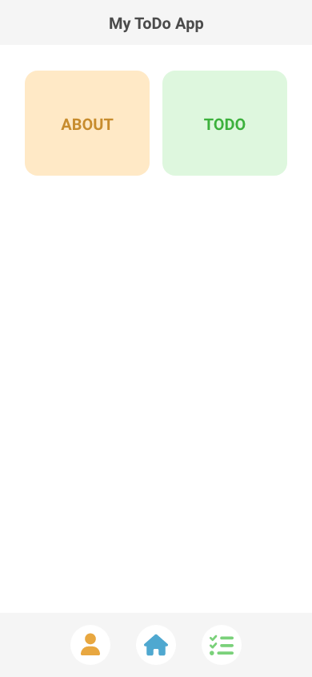
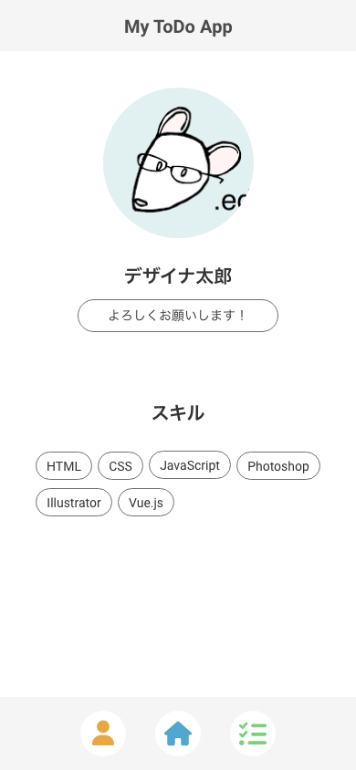
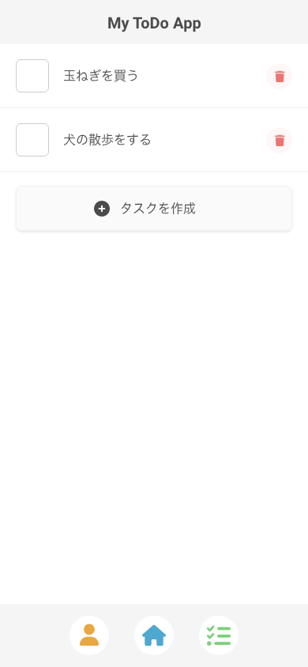

Training Vue3 + Express + Prisma | [目次](README.md)
# 今回つくるもの

- [今回つくるもの](#今回つくるもの)
  - [概要](#概要)
  - [今回使用する技術の一覧](#今回使用する技術の一覧)

## 概要
名称：My ToDo App
説明：シンプルなToDoアプリ

機能
- タスクの追加
- タスクの変更
- タスクの削除

画面
- home：ルーティングのためだけに用意したので中身には触れません
- about：同上
- todo：ここがメインで触る画面

画面のイメージ

今回はデザインに凝るのは主旨からずれるので、簡易的なデザインにとどめます。
UIフレームワークは使わず、cssは.vueの``内に書いていますが、
cssのソースコードは冗長になるので載せていません。

## 今回使用する技術の一覧

- フロントエンド
  - [Vite](https://ja.vite.dev/)
  - [Vue.js](https://ja.vuejs.org/)
  - [Vue Router](https://router.vuejs.org/)
- バックエンド（API）
  - [Express](https://expressjs.com/)
  - [Prisma](https://www.prisma.io/)
    - [SQLite](https://www.sqlite.org/)

***
[前提条件と準備](preparation.md) ｜ [プロジェクトのセットアップ](setup.md)