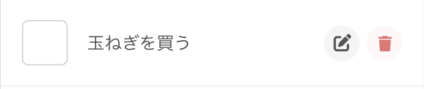

Training Vue3 + Express + Prisma | [目次](README.md)
# 画面を構築する
## ToDo画面の内容を作る

- [画面を構築する](#画面を構築する)
  - [ToDo画面の内容を作る](#todo画面の内容を作る)
    - [リストレンダリング `v-for`](#リストレンダリング-v-for)
      - [リストアイテムの構造を作る](#リストアイテムの構造を作る)
    - [`v-for`で配列の内容を反映する](#v-forで配列の内容を反映する)
    - [イベントハンドリング `v-on`](#イベントハンドリング-v-on)
  - [GlobalHeaderやToDo以外のViewをつくる](#globalheaderやtodo以外のviewをつくる)

### リストレンダリング `v-for`
ToDoリストは同じ構成のパーツをアイテム（タスク）の数だけ繰り返し描画する必要があります。
Vue.jsには`v-for`という、配列のアイテムの数だけ繰り返し描画できる仕組みがあります。
これを利用してリストを描画してみましょう。

#### リストアイテムの構造を作る


リスト部分の最小単位はこんな感じですね。
これを`src/views/ToDoApp.vue`の`<template>`に書いていきましょう。

```vuejs
<script setup>
import IconEdit from '@/components/icons/IconEdit.vue';
import IconDelete from '@/components/icons/IconDelete.vue';
</script>

<template>
  <main>
    <section class="list">
      <div class="list-item">
        <div class="content">
          <input type="checkbox">
          <input type="text" value="玉ねぎを買う">
        </div>
        <div class="action">
          <a class="btn edit"><IconEdit size="14" color="#555555" /></a>
          <a class="btn delete"><IconDelete size="14" color="#EB7474" /></a>
        </div>
      </div>
    </section>
  </main>
</template>
```
またアイコンを使うので、先ほどと同じようにコンポーネントにして呼び出ししています。

### `v-for`で配列の内容を反映する
まだAPIはないので、下記のようなダミーデータを用意します。
```json
[
  {id:1, title:"玉ねぎを買う", isDone:0},
  {id:2, title:"犬の散歩をする", isDone:0},
  {id:3, title:"猫のトイレを掃除する", isDone:0},
  {id:4, title:"廊下の電球を替える", isDone:0},
  {id:5, title:"ハンドソープを詰め替える", isDone:0}
]
```

`v-for`の構文の例
```html
<div v-for="item in 配列名">
  <p>{{ item.key名 }}</p>
</div>
```
`items`という配列から1つ1つ取り出したデータを`item`(ここの名前は任意で、itemじゃなくても良いです)として、
`item`のデータを使ってレンダリングができます。

今回の場合は配列の中で使用するのはtaskのみなので、先ほどの`ToDoApp.vue`はこう書き換えることができます。
```vuejs
<script setup>
import { ref } from 'vue'
import IconEdit from '@/components/icons/IconEdit.vue';
import IconDelete from '@/components/icons/IconDelete.vue';

const tasks = ref(
  [
    {id:1, title:"玉ねぎを買う", isDone:0},
    {id:2, title:"犬の散歩をする", isDone:0},
    {id:3, title:"猫のトイレを掃除する", isDone:0},
    {id:4, title:"廊下の電球を替える", isDone:0},
    {id:5, title:"ハンドソープを詰め替える", isDone:0}
  ]
)
</script>

<template>
  <main>
    <section class="list">
      <div class="list-item" v-for="task in tasks" :key="task.id">
        <div class="content">
          <input type="checkbox" v-model="task.isDone" @click="task.isDone = !task.isDone">
          <input type="text" :value="task.title">
        </div>
        <div class="action">
          <a class="btn delete"><IconDelete size="14" color="#EB7474" /></a>
        </div>
      </div>
    </section>
  </main>
</template>

<style>
 //styleは省略します。
</style>
```


### イベントハンドリング `v-on`
後々APIを実装したら、ボタンを押した時にアイテムが削除されるようにしますが、
今の時点ではvueにおけるイベントハンドリングを体験するために、簡単な例を書いてみます。

Vue.jsでは`v-on`ディレクティブを用いてDOMイベントを購読することができます。

`v-on:click` `v-on:change`のように書くか、または`v-on:`は省略形`@`にして
`@click` `@change`と書くことができます。

では実際にvueに書いてみます。

template側抜粋
```html
<div class="action">
  <a class="btn delete" @click="deleteTask(task.id)">
    <IconDelete size="14" color="#EB7474" />
  </a>
</div>
```

script側抜粋
```js
const deleteTask = (taskId) => {
  window.alert(taskId)
}
```

これで、削除アイコンボタンをクリックした際に`deleteTask()`が実行されてアラートウィンドウがでます。
タスクIDを引数に渡しているので、どのタスクで削除アイコンボタンが押されたかわかりますね。

## GlobalHeaderやToDo以外のViewをつくる
ここは動的な要素を入れていないのでどんなやり方でもできそうですね。
次のページからは、APIやDBに触れていきます。

***
[共通のパーツをcomponentsに切り分ける](components.md)｜ [SQLiteでデータを永続化しよう](sqlite.md)