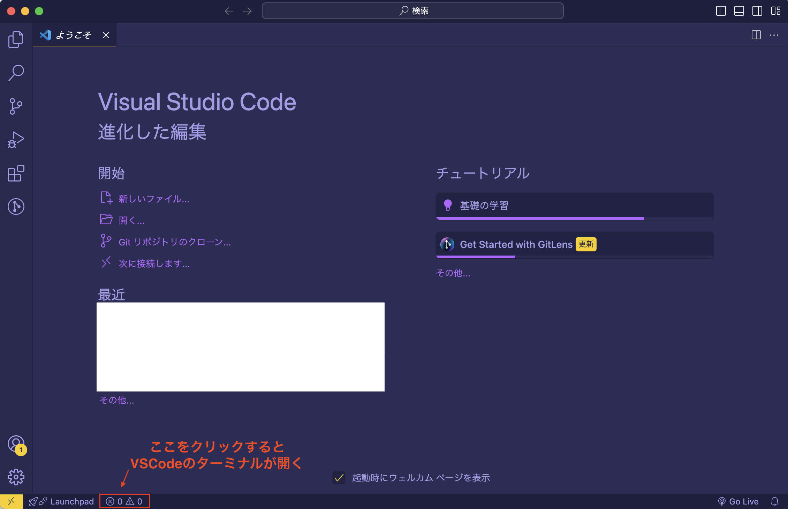
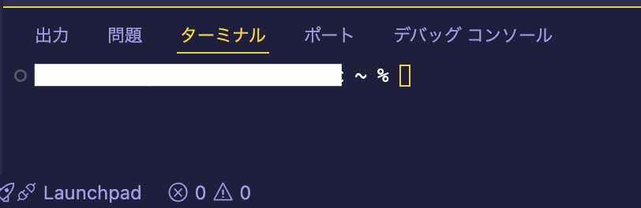
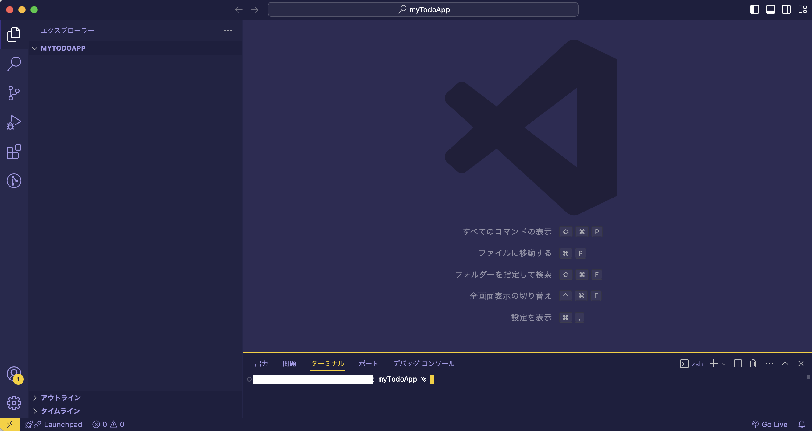
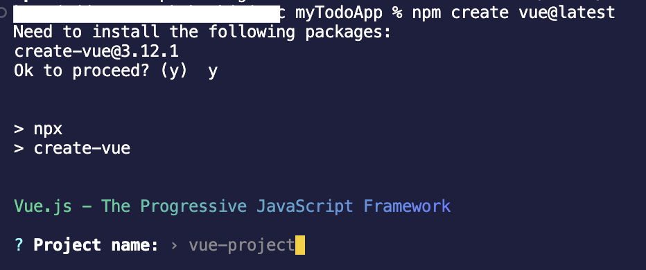
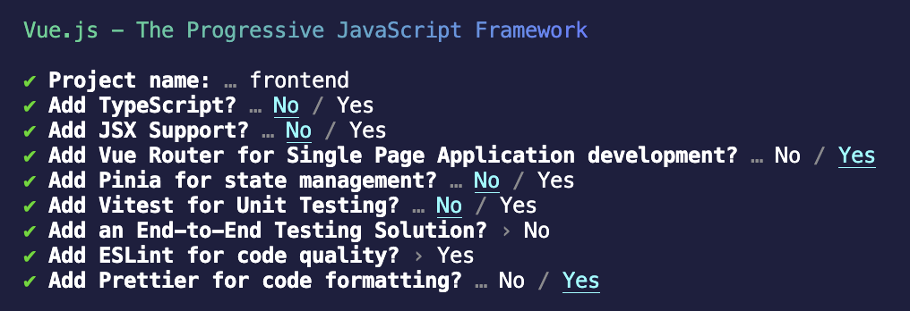
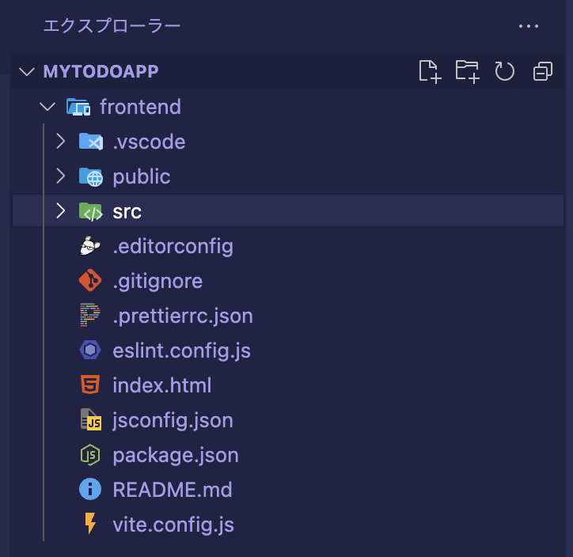

Training Vue3 + Express + Prisma | [目次](README.md)
# プロジェクトのセットアップ

- [プロジェクトのセットアップ](#プロジェクトのセットアップ)
  - [ワークスペースを作る](#ワークスペースを作る)
  - [Vueプロジェクトの作成](#vueプロジェクトの作成)
    - [`frontend`の中身](#frontendの中身)
    - [起動してみる](#起動してみる)
  - [`index.html`をちょっと変えておく](#indexhtmlをちょっと変えておく)

## ワークスペースを作る

まずはVSCodeを起動し、VSCode上からターミナルを開きましょう。


初期状態はこんな感じですね。Macのログインユーザのルート（つまり、`/Users/<user名>`）にいます。

まずはプロジェクトのルートフォルダを作成しましょう。
ユーザルートだとちょっとアクセスしづらいので、`dev`フォルダを作ってその中にでも作ってみます。

```shell
% mkdir dev
% cd dev
% mkdir myTodoApp
% cd myTodoApp
```
これで、今`/Users/<user名>/dev/myTodoApp`に入っています。
一旦myTodoAppをVSCodeのエクスプローラーで開いてターミナルを開きます。

ここで作業していきましょう。

## Vueプロジェクトの作成
Vue.js公式のやり方がとても便利で簡単です。Vueの開発の最初のステップは全部これで良いと思ってます。
- [Vue アプリケーションの作成 | Vue.js](https://ja.vuejs.org/guide/quick-start.html#creating-a-vue-application)

今回もこれに則ってやっていきます。ターミナルで以下のコマンドを実行しましょう。

```shell
npm create vue@latest
```
何か聞かれたら`y`を入力してEnterしてください。



対話型のプロンプトが開始されます。

今回はこんな感じで答えましょう。


すべて答え切ると、create vueがプロジェクトを作ってくれます。簡単ですね。

### `frontend`の中身


こんな感じになっていると思います。

<details>
<summary>
内容の詳細
</summary>

- `.vscode`: VSCodeの設定ファイルを格納するディレクトリ
- `public`: ビルド対象に含まずそのまま公開するものを置くディレクトリ
- `src`: ビルド対象になる全てのソースが含まれるディレクトリ
  - `assets`:cssや画像などのアセットを格納するディレクトリ
  - `components`: 共通で使うコンポーネントを格納するディレクトリ
  - `router`: vue-routerの関連ファイルを格納するディレクトリ
  - `views`: 画面のファイルを格納するディレクトリ 
  - App.vue : 全画面共通の一番根元になるvueファイル。あってもなくてもいいがデフォルトでは存在している。
  - main.js : エントリーポイントとなるjsファイル。index.htmlから呼ばれる。
- .editorconfig : エディタの種類が違っても基本的な設定（インデントの幅など）が共有できるようになる設定ファイル
- .gitignore : Gitの変更検知から除外する対象を指定するファイル
- .prettierrc.json : Prettierの設定ファイル
- index.html : ビルドされたソースはsrc/main.jsを通じてこのhtml内から呼ばれ、各ページが描画される
- jsconfig.json : JavaScriptの設定ファイル
- package.json : npmのパッケージ管理ファイル
- README.md : プロジェクトの取説。自分のアプリケーションができてきたら中身を書き換えるとよい
- vite.config.js : Viteの設定ファイル
</details>

  

### 起動してみる
```shell
cd frontend
npm install
npm run dev
```

起動したら、webブラウザで
http://localhost:5173
にアクセスしてみましょう。

## `index.html`をちょっと変えておく
変えなくても動作に関係ないので問題はないのですが、
デフォルトのままだと気分的に盛り上がらないので変えておきます。
`<html lang="">`→`<html lang="ja">`
`<title>Vite App</title>`→`<title>My ToDo App</title>`

***
[今回つくるもの](concept.md) ｜ [ページの用意とルーティング](views_and_routing.md)