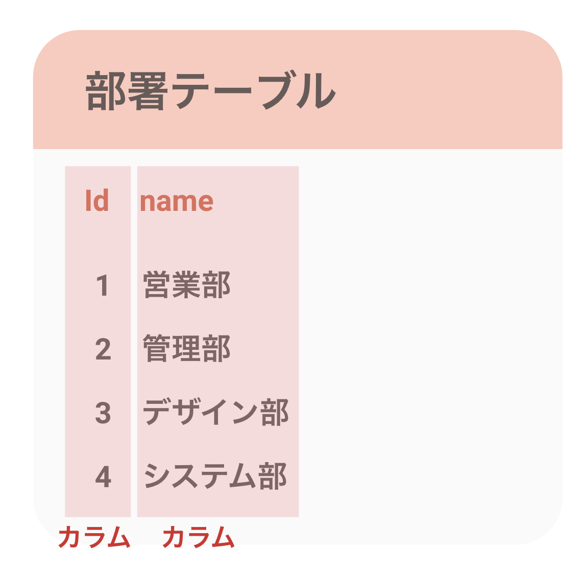
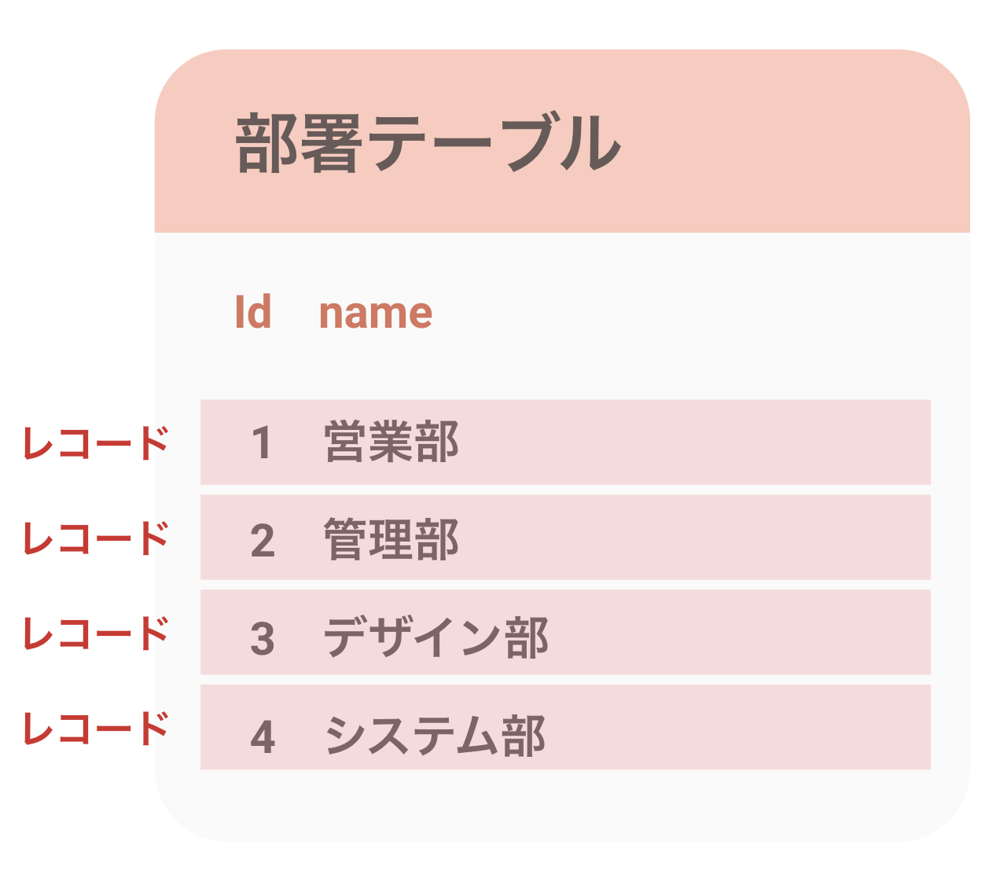
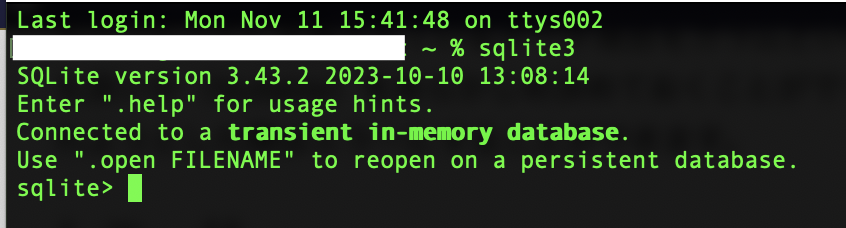

Training Vue3 + Express + Prisma | [目次](README.md))
# データを永続化しよう


- [データを永続化しよう](#データを永続化しよう)
  - [データの永続化とは？](#データの永続化とは)
  - [データベースの基礎](#データベースの基礎)
    - [テーブル](#テーブル)
    - [カラム](#カラム)
    - [レコード](#レコード)
    - [CRUD](#crud)
  - [ SQLiteについて](#-sqliteについて)
    - [SQLiteの特長](#sqliteの特長)
  - [OSにSQLiteを追加する](#osにsqliteを追加する)
  - [DBの設計を考える](#dbの設計を考える)
    - [テーブル](#テーブル-1)
    - [カラム](#カラム-1)
  - [SQLiteでDBを用意する](#sqliteでdbを用意する)
    - [DBの作成](#dbの作成)
    - [DBからの切断](#dbからの切断)
    - [DBへの再接続](#dbへの再接続)
    - [テーブルの作成（`CREATE`文）](#テーブルの作成create文)
    - [テーブルにデータを挿入する（`INSERT`文）](#テーブルにデータを挿入するinsert文)
    - [データの取得（`SELECT`文）](#データの取得select文)
    - [DBの準備完了](#dbの準備完了)

## データの永続化とは？
これまで作ってきたアプリケーションは、画面のリロードをするとタスクのデータが消えてしまっていました。
これは現在データはインスタンス上だけで生きていて永続性がないからです。
Vueインスタンスは、画面のリロードや遷移が発生すると一旦破棄されるので、そのタイミングでデータが消えてしまいます。その場だけでタスクが処理されて完結する仕組みを作る場合はインスタンス上にデータを持たせるだけでいいですが、ToDoリストはデータが残っていないと困りますね。

どこかにデータを保存し、そのデータは明示的に破棄しない限りいつでも呼び出せる。それがデータの永続化です。

そしてデータの永続化の方法として最も一般的なのがデータベースの利用です。

## データベースの基礎
### テーブル

データベースがデータを保管する箱をテーブルといいます。
1つのデータベースの中には必要であれば複数のテーブルを作って使い分けることができます。

### カラム

テーブルごとに定義されているデータ項目をカラムといいます。
カラムはデータの型（INTなど）や、空でも良いか（Nullable）をあらかじめ決めておくことができます。
これにより予期せぬ形式のデータが登録されようとした際はエラーにすることができます。

### レコード

テーブルに登録されるデータをレコードといいます。レコード数が多いとテーブルの容量は当然ながら増えますし、カラム数が多いと1レコードあたりのデータ量も増えますね。


### CRUD
データベースを用いてデータを操作するとき、核となる機能は主に次の4つです。
これをCRUDといいます。

- Create ... 新しいデータを登録する
- Read ... レコードをテーブルから取り出す
- Update ... レコードの内容を更新する
- Delete ... レコードを削除する


***
##  SQLiteについて
> 今回はPrismaというツールがDB作成ごと請け負ってくれるので、DB作成などの操作を手作業ですることはありませんでしたが、一応SQLiteについて勉強したところもそこそこの物量だったので残しておきます。

データベースには色々な種類がありますが、今回は一般的でかつ取り扱いやすいSQLiteを使って、
データベースの基本を押さえながらデータを永続化してみましょう。

### SQLiteの特長
ファイルベースでデータベースを作成するため、データベース用に別途サーバーを用意する必要がなく、ローカルでもプロジェクト上に簡単にデータベースを持つことができます。

また、SQLiteではSQL文を使用することができます。SQLは国際標準のDB言語です。
SQLiteで使ったSQL文はMySQLなど他のメジャーなDBでも同じように使えます。
SQLは汎用的な知識として活かせるので、SQLiteは初学者の学習には最適ですね。

もちろん学習用のDBというわけではなく、小さなアプリケーション（データが数百MB以下）やwebサイトであれば実際本番運用するDBとしても利用できます。
今後何か作りたいものがある時は採用を検討してもいいかもしれません。

## OSにSQLiteを追加する
ターミナルを開いて
```bash
sqlite3
```
を実行してみましょう。



SQLiteの対話型シェルが起動してインメモリデータベースに接続されました。
端末にSQLiteが入っていればこのように起動できます。
Macはデフォルトで端末にSQLiteが入っていますが、もし何かしらの理由でSQLiteが入っていない場合は、
下記のコマンドでHomebrewを使ってインストールすることができます。

```bash
brew install sqlite
```

## DBの設計を考える
### テーブル
今回作るToDoリストはとてもシンプルなものなので、テーブルはタスクを格納するための
`tasks`テーブル1つのみを作ることにします。

### カラム
カラムは以下にします。
- id
- title
- isDone

簡単ですね。

## SQLiteでDBを用意する
GUIで操作する方法もありますが、<small style="opacity:0.4;">アプリケーションのインストールは情シスの許可を取らないといけないので</small>今回はターミナルでコマンドラインでやってみます。

### DBの作成
```bash
% cd [プロジェクトのrootのpath]
% mkdir db
% cd db
% sqlite3
% .open todoapp.db
```
まずはプロジェクトのrootにcdで移動し、そこにdbという名前のディレクトリを作成しています。
さらにcdでdbディレクトリに入り、その中にデータベースを作成しました。
今回はDB名をtodoappとしていますが、ここはお好みでOKです。
`sqlite3 <DB名>.db`コマンドは指定したdbファイルが存在していればそのdbファイルに接続し、存在していなければ新規作成します。

### DBからの切断
```bash
sqlite> .quit
```
`.quit`でSQLite3のシェルから離脱することができます。離脱しただけなのでDB自体は消えません。

### DBへの再接続
```bash
% sqlite3 todoapp.db
```
DBの作成と同じコマンドですが、今回はすでに`todoapp.db`が存在しているので、
既存のDBに接続されます。

もしくは下記のコマンドでシェルの起動とDBへの接続をそれぞれすることもできます。
```shell
% sqlite3
% sqlite> .open <ファイル名>
```

### テーブルの作成（`CREATE`文）
ここからはSQL文でのDB操作です。
まずテーブルを作成しましょう。今回は`tasks`テーブル1つのみでしたね。
カラムもidとtitleとisDoneの3つだけですのでシンプルです。

SQLの`CREATE`文を使用してテーブルを作成してみます。
`CREATE`文の構造は以下です。

```sql
CREATE TABLE <table名> (
  <カラム名> <データ型> PRIMARY KEY,
  <カラム名> <データ型>
);
```

```sql
CREATE TABLE tasks (
    id INTEGER PRIMARY KEY,
    title TEXT,
    isDone INTEGER
);
```

<b>`PRIMARY KEY`について</b>
会話の中ではよく主キーと言われているもので、
レコードを一意に管理するために使われる第一のキーです。
主キー以外にもレコードに対して一意なものがある場合も設計によってはありますが、
主キーはDBがテーブルでレコードを扱う上で、レコードを確実に特定するために使用されます。

### テーブルにデータを挿入する（`INSERT`文）
```sql
INSERT INTO tasks (title,isDone)
VALUES ('玉ねぎを買う',0),('犬の散歩をする',0);
```

これで`tasks`テーブルに2レコードが追加されました。
配列でのイメージはこんな感じです。
```json
[
  {id:1, title:'玉ねぎを買う', isDone:0},
  {id:2, title:'犬の散歩をする', isDone:0}
]
```
<b>`INSERT`文に`id`は書かなくていいの？</b>
はい、書かなくて大丈夫です。
SQLは新しいデータを挿入するときに主キーを自動で振って、一意になるよう管理してくれるからです。
そうでないと毎回テーブルにある最新の主キーが何かを調べないといけないですもんね。

### データの取得（`SELECT`文）
実際にテーブルの中身を見てみましょう。

```sql
SELECT * FROM tasks;
```

### DBの準備完了
今度はフロントエンド（Vue.js）側から
このDBに接続してデータを操作していきましょう。

***
[機能を実装してみよう](implement_function.md) | [フロントエンドからDBに接続する](api.md)