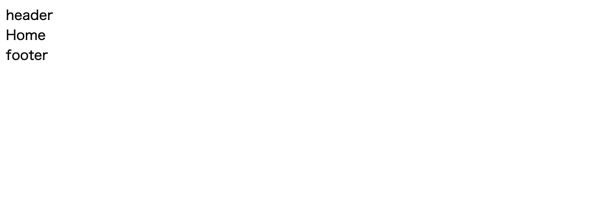

Training Vue3 | [目次](TOC.md)
# ページの用意とルーティング

- [ページの用意とルーティング](#ページの用意とルーティング)
  - [初期状態のファイルの削除・編集](#初期状態のファイルの削除編集)
    - [削除する](#削除する)
    - [リセットcssの追加](#リセットcssの追加)
    - [編集する](#編集する)
  - [viewを追加する](#viewを追加する)
    - [初期状態のプロジェクトの下処理後](#初期状態のプロジェクトの下処理後)
  - [ルーティングする](#ルーティングする)

## 初期状態のファイルの削除・編集
ここから主に`src`内をいじっていきます。
まずはcreate vueによってサンプルファイルがいくつか入っているのですが
自分でアプリを作っていく際は不要だったり内容を変えたかったりするので調整していきます。

### 削除する
- src/assets の中身
- src/components の中身

この2ディレクトリの中にあるファイルは全て新しいファイルに入れ替わることになるので
削除してしまいましょう。

この時点でブラウザで開いている `localhost:5173`はエラー表示が出ますが
気にせず続けます。

### リセットcssの追加
デフォルトで入っていたassetsのcssを全て削除し、
今回は特にUIフレームワークも使わないので
今のままだとcssのリセットが一切ない状態です。
一応用意して `src/assets`の中に入れておきましょう。

今回はress.min.cssを追加します。
https://github.com/filipelinhares/ress/blob/master/dist/ress.min.css

直下に`src/assets/ress.min.css`として入れましたが、
分けたい場合は`src/assets/css/ress.min.css`など好みで大丈夫です。

### 編集する
`src/main.js`
元々あったcssファイルは削除して、ress.min.cssを入れたので、
読み込むcssを変えておきます。もしsassを使っている場合は、
ここにコンパイル後のcssを指定しておくと良いですね。
今回cssは各vueファイルの`<style scoped></style>`に書く予定なので、
このmain.jsで読み込むのはリセットcssだけでOKです。

```js
import './assets/ress.min.css'
import { createApp } from 'vue'
import App from './App.vue'
import router from './router'

const app = createApp(App)

app.use(router)

app.mount('#app')
```

views内の各vueファイルはこの後いじっていくので、
中身をシンプルにしておきます。

`src/App.vue`

```vuejs
<script setup>
import { RouterView } from 'vue-router'
</script>

<template>
  <header>header</header>
  <RouterView />
  <footer>footer</footer>
</template>

<style scoped></style>
```

`src/views/HomeView.vue`
```vuejs
<script setup>
</script>

<template>
  <main>
    Home
  </main>
</template>

<style scoped>
</style>
```

`src/views/AboutView.vue`
```vuejs
<script setup>
</script>

<template>
  <main>
    About
  </main>
</template>

<style scoped>
</style>
```


## viewを追加する
ToDoアプリ画面用のviewがないのでviewsに追加します。
`src/views/ToDoApp.vue`
```vuejs
<script setup>
</script>

<template>
  <main>
    ToDoApp
  </main>
</template>

<style scoped>
</style>
```

### 初期状態のプロジェクトの下処理後


こうなっていればOK。App.vueに書かれているheader、footerのほか、
`/`にルーティングされているHome.vueが`<RouterView />`によって表示されています。

## ルーティングする
viewを増やしたので、`src/router/index.js`にルーティングを追加します。

```js
import { createRouter, createWebHistory } from 'vue-router'
import HomeView from '../views/HomeView.vue'

const router = createRouter({
  history: createWebHistory(import.meta.env.BASE_URL),
  routes: [
    {
      path: '/',
      name: 'home',
      component: HomeView,
    },
    {
      path: '/about',
      name: 'about',
      // route level code-splitting
      // this generates a separate chunk (About.[hash].js) for this route
      // which is lazy-loaded when the route is visited.
      component: () => import('../views/AboutView.vue'),
    },
    {
      path: '/todo',
      name: 'todo',
      component: () => import('../views/ToDoApp.vue'),
    },
  ],
})

export default router
```

ブラウザのアドレスバーで
`localhost:5173/about`
`localhost:5173/todo`
が表示されるか確認してみましょう。

***
[プロジェクトのセットアップ](setup.md) ｜ [共通のパーツをコンポーネントにする](components.md)